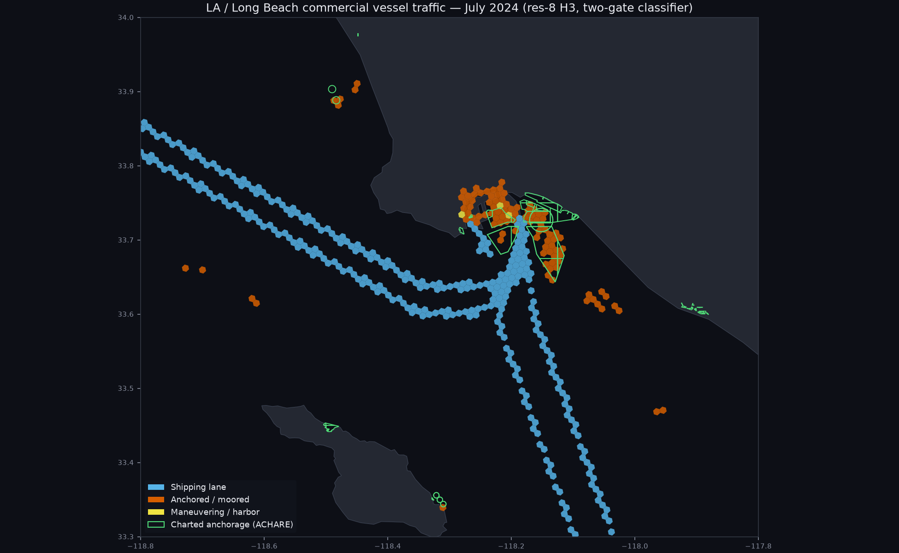
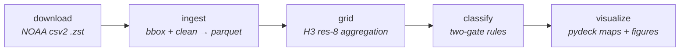
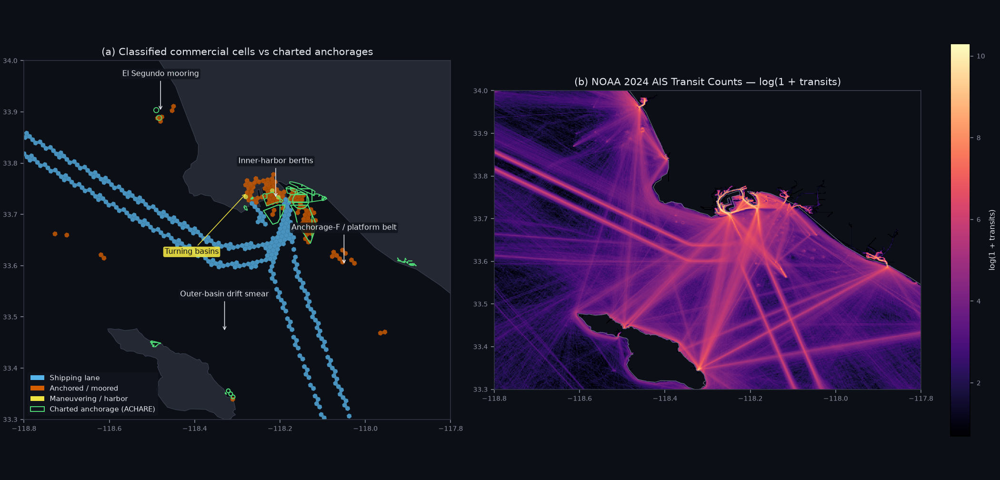

# ais-density



A reproducible pipeline that turns a month of raw NOAA AIS point data into a
classified vessel-traffic map. Daily AIS files are downloaded, filtered to a
region and cleaned, aggregated onto an [H3](https://h3geo.org) hex grid, and then
labelled by a transparent two-gate rule into **shipping lanes**, **anchored /
moored**, and **maneuvering / harbor** cells — separating the commercial
(cargo + tanker) story from the recreational noise that dominates a naïve density
map. Everything is config-driven and reproducible from an empty `data/` with a
single `make all`.

## Architecture

Five config-driven stages; each reads the previous stage's parquet and loops over
every region and window declared in `config.yaml`.



## Data processed

One region (LA / Long Beach, bbox `[-118.80, 33.30, -117.80, 34.00]`), one 31-day
window (July 2024):

| stage | count |
| --- | --- |
| raw AIS rows scanned | 299,393,712 |
| after bbox filter | 8,805,438 |
| after cleaning (valid lat/lon/SOG/MMSI) | 8,765,460 |
| H3 res-8 cells (all traffic) | 6,494 |
| commercial cells classified | 398 (297 lane · 98 anchored · 3 maneuvering) |

**≈ 299 M raw records → 8.8 M clean pings → 6,494 cells.** The full pipeline
(ingest → grid → classify → visualize, excluding download) runs in **~73 s** with
a **~563 MB** peak RSS on an Apple M4 Pro; the grid/classify/visualize stages are
each ~1 s, so ingest dominates.

## Findings

1. **Naïve density is a marina map; stratifying recovers the commercial story.**
   The all-traffic density view is dominated by recreational hotspots (Marina del
   Rey, the small-craft basins). Restricting to the cargo + tanker stratum, with
   its own density gate, isolates the shipping corridors and terminal approaches
   the hero map shows.
2. **More data sharpens the anchored class onto charted anchorages.** At 7 days
   only 34 % of commercial `anchored/moored` cells fell inside charted ENC
   anchorages; at 30 days it is **56 %**. The higher ping-density gate (P90 pings
   77 → 279) drops the transient low-persistence drift cells, concentrating the
   set on genuine anchorages. The anchored-cell set has a Jaccard of **0.53**
   between the 7-day and 30-day runs — a stable persistent core with a
   gate-sensitive margin, exactly as expected.
3. **The residual "neither" anchored cells decompose into four traceable
   signatures** — inner-harbor terminal berths, the El Segundo offshore mooring
   terminal, high-persistence holding adjacent to Anchorage F / the platform belt,
   and a diffuse outer-basin drift smear toward Catalina (JIT queuing). None is a
   classifier error; see [Validation](#validation) and [Limitations](#limitations).
4. **A July 4th holiday-weekend fleet uptick.** Distinct vessels rise from a
   Mon–Wed baseline of 805–860 to 921 on July 4 and stay elevated through the
   weekend (894–934 on July 5–7). The scheduled cargo/tanker fleet does not swing
   day-to-day, so the increase is holiday recreational traffic.
5. **The port runs around the clock, with a shallow midday-local peak.** Hourly
   pings peak at 18:00–20:00 UTC (~11:00–13:00 local PDT) and trough at
   06:00–08:00 UTC (overnight local) — a **1.42×** peak/trough ratio, a real but
   modest diurnal rhythm rather than a day/night on/off cycle.

Interactive per-view maps (`make visualize` → `maps/region=<r>/window=<w>/`, dark
CARTO basemap, hover popups, legend, ACHARE overlay): `classification.html`
(the hero), `commercial_density.html` / `all_traffic_density.html` (stratified vs
naïve, log colour), and `median_speed.html`. The HTML is gitignored; regenerate it
with `make visualize`.

## Validation



**(a)** Classified commercial cells over charted ENC anchorages (ACHARE, green),
with the four residual "neither" groups annotated. **(b)** NOAA's 2024 AIS Vessel
Transit Counts raster, georeferenced from its native EPSG:3857 to the same lon/lat
extent and coloured by `log(1 + transits)`. The classifier's lanes in (a) trace
the same corridors the independent transit raster lights up in (b): the twin
traffic-separation-scheme parallels from the northwest, the southeast departure
fan, and the harbour-entrance hotspot.

The labels are cross-checked against three independent references:

- **ENC charted anchorages (Referee A).** NOAA ENC S-57 `ACHARE` polygons
  (harbour + approach scales, from the LA/Long Beach approaches charts, incl.
  US chart 18751) — 56 % of commercial `anchored/moored` cells intersect a charted
  anchorage; the residual is the four explained signatures above.
- **NOAA AIS Vessel Transit Counts (Referee / Task 4.3).** Sampling the 2024
  transit raster (100 m, EPSG:3857) at each commercial cell centroid: median
  transits are `maneuvering/harbor` 2,312, `shipping lane` 239, `anchored/moored`
  147, `unclassified` 23 (raster background p50 = 22, p90 = 167). Lane cells sit at
  ~10× the background and above the raster's own p90 — genuine NOAA corridors.
- **AIS `status` field (Referee B).** The self-reported navigational status
  ("at anchor" / "moored" / "under way") independently corroborates the anchored
  and lane labels on the same cells.

Reference-data provenance (ENC polygons, Natural Earth coastline, the transit
raster) is documented under [Reference data](#reference-data).

## How to run

### Setup

```bash
uv sync
```

### Configuration

Windows (date ranges) and regions (bounding boxes) are declared in `config.yaml`:

```yaml
windows:
  jul_2024:
    start: 2024-07-01
    end: 2024-07-31

h3:
  resolution: 8            # global default

classify:
  activity_quantile: 0.90       # lane + maneuvering gate (unique vessels)
  anchor_ping_quantile: 0.90    # anchored gate (ping density)
  anchor_sog_max: 1.0           # median SOG below this → anchored/moored
  lane_sog_min: 6.0             # median SOG at/above this → shipping lane

regions:
  la_long_beach:
    bbox: [-118.80, 33.30, -117.80, 34.00]   # [min_lon, min_lat, max_lon, max_lat]
    # h3:
    #   resolution: 9      # optional per-region override
```

Any number of windows and regions can be added; each is validated on load (date
order, bbox `min < max`, H3 resolution `0–15`). See `src/config.py`.

### Pipeline

```bash
make all             # download → ingest → grid → classify → visualize
make clean           # drop derived data (interim/processed/maps/ledgers), keep raw
make lint            # ruff check + mypy (strict, scoped to src/)
uv run pytest        # tests
```

Each stage is also a standalone target; pass flags through `ARGS`:

```bash
make download ARGS=--force     # re-download even if the local hash matches
make grid ARGS=--force         # recompute a stage whose output already exists
```

### Pipeline stages

- **download (`src/download.py`)** — fetches each day's file via `pooch` with a
  per-file progress bar; a file is skipped when it exists and its sha256 matches
  `data/raw/registry.txt`, else re-downloaded. A bounded read timeout and retry
  loop survive NOAA's occasionally flaky blob endpoint. `--force` bypasses the
  cache.
- **ingest (`src/ingest.py`)** — one DuckDB `COPY (SELECT … WHERE …) TO parquet`
  per day: bbox filter from config (parameterized), validity checks
  (`lat ∈ [-90,90]`, `lon ∈ [-180,180]`, `sog ∈ [0,40]`, 9-digit MMSI), and column
  pruning to the canonical schema (dropping vessel name / IMO / call sign).
  Idempotent per day unless `--force`. Writes
  `data/interim/region=<r>/date=YYYY-MM-DD/part.parquet` and appends the per-day
  funnel (raw → bbox → clean) to `data/run_ledger.csv`.
- **grid (`src/grid.py`)** — one pass per region-window aggregates pings onto an
  H3 grid (resolution from config) into three parquets under
  `data/processed/region=<r>/window=<w>/`: `cells.parquet`,
  `cells_by_type.parquet` (cell × vessel category), `cells_by_hour.parquet`
  (cell × hour-of-day). The headline metric is `COUNT(DISTINCT mmsi)`.
- **classify (`src/classify.py`)** — two-gate rules over two strata (all traffic,
  and commercial = cargo + tanker). Gates are the input distribution's own
  quantiles: anchored is gated on a **ping-density** quantile (anchorages are
  ping-dense but vessel-sparse), lane / maneuvering on a **unique-vessel**
  quantile. Cells at/above gate are labelled by `median_sog`. Writes
  `cells_classified.parquet` and logs per-class counts to `data/class_ledger.csv`.
- **visualize (`src/visualize.py`)** — pydeck interactive HTML per view plus the
  matplotlib hero and validation figure (`docs/img/`). The `h3` uint64 cell id is
  converted to a hex string with `h3_h3_to_string` only here, at render time.

### Reference data

Referee datasets used to sanity-check the classifier live in `data/static/`.

**Charted anchorage / harbor polygons (NOAA ENC via ENC Direct to GIS).** Pulled
from the ArcGIS REST service, clipped to the region bbox, and vendored as GeoJSON:

```bash
BASE="https://encdirect.noaa.gov/arcgis/rest/services/encdirect"
Q="query?geometry=-118.80,33.30,-117.80,34.00&geometryType=esriGeometryEnvelope&inSR=4326&spatialRel=esriSpatialRelIntersects&outFields=*&outSR=4326&f=geojson"

# Anchorage areas (S-57 ACHARE): harbour scale (layer 186) + approach scale (191)
curl -s "$BASE/enc_harbour/MapServer/186/$Q" -o data/static/anchorages_la_long_beach.geojson
curl -s "$BASE/enc_approach/MapServer/191/$Q" -o data/static/anchorages_approach.geojson
```

Discover layer IDs by browsing `"$BASE/enc_harbour/MapServer/layers?f=json"`.

**Coastline / landmask (Natural Earth 10 m).** For orientation on the figures,
`ne_10m_land` is clipped to the bbox with DuckDB spatial and vendored as
`data/static/land_la_long_beach.geojson`:

```bash
curl -sSL "https://raw.githubusercontent.com/nvkelso/natural-earth-vector/master/geojson/ne_10m_land.geojson" -o /tmp/ne_10m_land.geojson
duckdb <<'SQL'
INSTALL spatial; LOAD spatial;
COPY (
  SELECT ST_Intersection(geom, ST_MakeEnvelope(-118.80, 33.30, -117.80, 34.00)) AS geom
  FROM ST_Read('/tmp/ne_10m_land.geojson')
  WHERE ST_Intersects(geom, ST_MakeEnvelope(-118.80, 33.30, -117.80, 34.00))
) TO 'data/static/land_la_long_beach.geojson' WITH (FORMAT GDAL, DRIVER 'GeoJSON');
SQL
```

**NOAA AIS Vessel Transit Counts.** The annual raster is a ~466 MB BigTIFF — it
won't open in macOS Preview (expected, not corruption) and is **gitignored**
(`data/static/*.tif`); read/clip it with GDAL/rasterio. Clip to the bbox and
compare against the classified cells:

```bash
uv run python - <<'PY'
import rasterio, duckdb, numpy as np
from rasterio.warp import transform, transform_bounds
from rasterio.windows import from_bounds

bbox = (-118.80, 33.30, -117.80, 34.00)
with rasterio.open('data/static/ais-transit-count-2024.tif') as r:
    win = from_bounds(*transform_bounds('EPSG:4326', r.crs, *bbox), transform=r.transform)
    data, prof = r.read(1, window=win), r.profile
    prof.update(height=data.shape[0], width=data.shape[1],
                transform=r.window_transform(win), compress='lzw')
    with rasterio.open('data/static/transit_2024_la_long_beach.tif', 'w', **prof) as dst:
        dst.write(data, 1)

con = duckdb.connect(); con.execute('INSTALL h3 FROM community; LOAD h3;')
rows = con.execute("SELECT label, h3_cell_to_latlng(cell)[1], h3_cell_to_latlng(cell)[2] "
    "FROM read_parquet('data/processed/region=*/window=*/cells_classified.parquet', "
    "hive_partitioning=true) WHERE stratum='commercial'").fetchall()
lab = np.array([x[0] for x in rows])
with rasterio.open('data/static/transit_2024_la_long_beach.tif') as r:
    xs, ys = transform('EPSG:4326', r.crs, [x[2] for x in rows], [x[1] for x in rows])
    v = np.array([s[0] for s in r.sample(list(zip(xs, ys)))], float)
for k in ['maneuvering/harbor','shipping lane','anchored/moored','unclassified']:
    print(f'{k:20s} n={int((lab==k).sum()):4d} median_transit={int(np.median(v[lab==k]))}')
PY
```

### Querying the output

```sql
-- one partition
SELECT * FROM 'data/interim/region=la_long_beach/date=2024-07-01/part.parquet';

-- all days/regions with the partitions as columns
SELECT * FROM read_parquet('data/interim/region=*/date=*/part.parquet', hive_partitioning = true);
```

## Data source

Daily US AIS from NOAA's `csv2` collection (one Zstandard-compressed CSV per day):

```
https://noaaocm.blob.core.windows.net/ais/csv2/csv{YYYY}/ais-{YYYY-MM-DD}.csv.zst
```

Files land in `data/raw/` and their sha256 is tracked in `data/raw/registry.txt`.

## Limitations

- **AIS has coverage gaps and spoofing.** Terrestrial AIS misses vessels out of
  receiver range and drops messages in congestion; positions can be absent,
  delayed, or deliberately falsified. Density here reflects *received* messages,
  not ground truth.
- **US coverage only.** NOAA's feed is US terrestrial AIS, so traffic is only
  captured near US shores — fine for a US port study, not for open-ocean routes.
- **~1-minute effective sampling.** The grid counts pings, not continuous tracks;
  a fast vessel crossing a cell contributes fewer pings than a slow one, which is
  intended (it drives the SOG/density signal) but means cell ping counts are not
  directly comparable across speeds.
- **Single month, single year.** All findings are for July 2024; seasonal and
  year-over-year variation is out of scope for v1.
- **Berth vs anchorage not split (v1).** Both are labelled `anchored/moored`;
  distinguishing a terminal berth from an anchorage is out of scope.
- **`vessel_type` is self-reported.** AIS ship-type codes are operator-declared
  and may be wrong or missing (~1 % are null/0); the commercial stratum inherits
  that noise.
- **Commercial-stratum speed is approximate.** The commercial `median_sog` is a
  ping-weighted blend of the cargo and tanker per-category medians, since the
  exact combined median isn't recoverable from the aggregated grid.

## License

[MIT](LICENSE).
